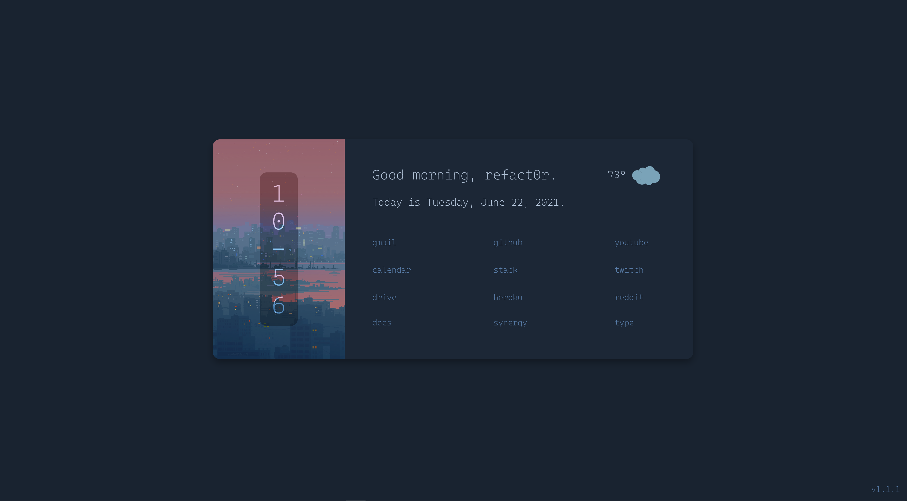

# Startpage

A simple startpage made with Svelte and Openweathermap API.



## Using this startpage

1. Download or clone the repository.
```
git clone https://github.com/refact0r/startpage
```

3. Enter the folder
```
cd startpage
```

2. Install dependencies.
```
npm i
```

3. OPTIONAL: To display your name and weather, go to `src/main.js` and change the variables. You will need an api key from https://openweathermap.org/ for the weather to work.

4. Build.
```
npm run build
```

5. If you are using Chrome, click "Load Unpacked" in the Extensions settings and then select the `public` folder. You are finished!

6. If you are using Firefox, enter the `public` folder. Then sign the extension with an api key and api secret from https://addons.mozilla.org/developers/addon/api/key/.
```
cd public
web-ext sign --api-key=$API_KEY --api-secret=$API_SECRET
```

7. After it is finished, you should see a folder called `web-ext-artifacts` with a `.xpi` file inside. Go to the Extensions settings in Firefox, click "Install Add-on From File...", and select the `.xpi` file.
