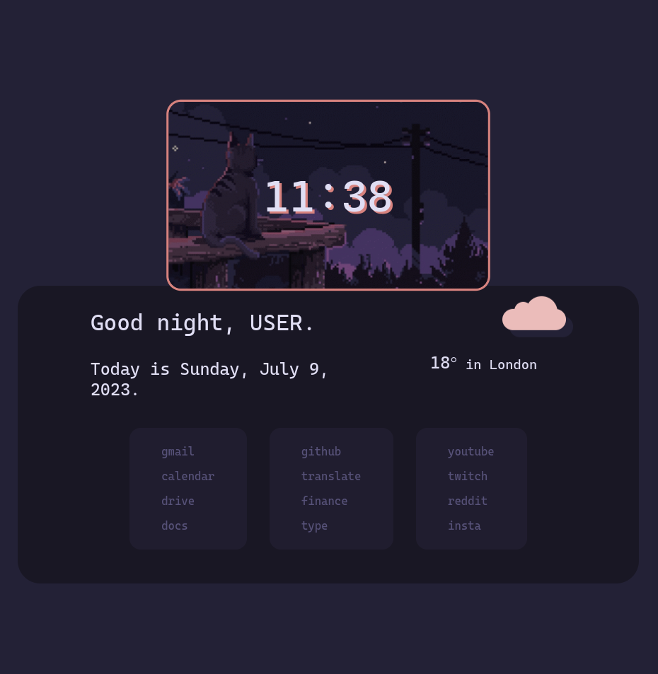

# Startpage Rose Pine

My fork of a clean [startpage](https://github.com/refact0r/startpage) made with Svelte by [refact0r](https://github.com/refact0r) to add some soho vibes.

## My modifications:

- Made for a new system customization with [Rose Pine Color Scheme](https://github.com/rose-pine).
- Design for this one is friendly and more responsive to tiled windows taking half a screen. Flexbox changed to column, clock with feature image moved to top and flow of the page is kept vertical.
- Changed the cloud icon to one using pseudoelements to avoid some weird div border artifacts (not sure if browser or color related) happening when box shadows were used.
- Removed swappable gifs, instead only one is used by default, but made to match the Rose Pine colors really nice.



## Installation

#### A) Firefox Manually:

- Customize to your liking before install

- Requires:
  > git, npm, web-ext.js, mozilla developer account
- Open a terminal, clone this repo and navigate to the folder

```bash
git clone https://github.com/tom-gora/startpage-rose-pine.git
cd startpage-rose-pine
```

- Install dependencies

```bash
npm install
```

- Build files are here so just run

```bash
npx web-ext build
```

- Go to [Mozilla Dev Hub](https://addons.mozilla.org/developers/), log in, click submit a new addon.

- Follow the instructions providing the zip file placed in

```bash
./web-ext-artifacts
```

- Provide the source code (src directory) zipped for automatic review.

- A few minutes later download your own extension to the browser.

#### B) Chrome

- Download or clone this repository.

- Remove lines 9-11 (the "chrome_settings_overrides" section) from public/manifest.json.

- Go to chrome://extensions/ in chrome and turn on developer mode (top right).

- Click "Load unpacked" and select the /public/ folder from this repository.

## Customization

To change the name and enable weather, hover in the bottom right corner and a settings button should show up.

#### Changing links

1. Go to the new tab page and press `Ctrl+Shift+I`.
2. Click the tab labelled `Storage` (Firefox) / `Application` (Chrome).
3. Click on this extension's id under `Local Storage`.
4. You should see one field with the key `config` show up with a bunch of JSON text as the value.
5. Copy the JSON into a text editor and change the links.
6. Paste the edited JSON back into the config value field and reload the page.

### BIG THANKS TO REFACT0R FOR SUPPORT IN INSTALLING THIS THE FIRST TIME MONTHS AGO

#### 🚀🚀🚀 when I did not know what I was doing but wanted to learn 🚀🚀🚀
